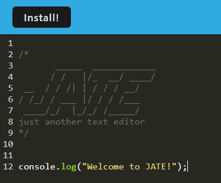
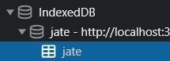
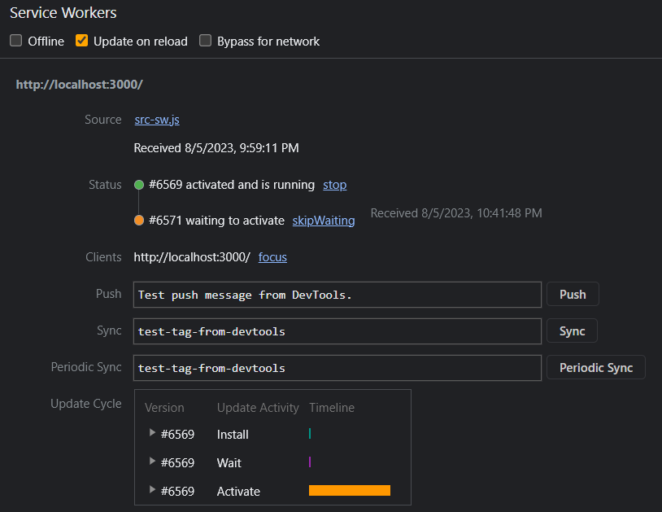

# Text-Editor

## Table of Contents
- [Description](#description)
- [Installation](#installation)
- [Usage](#usage)
- [Technologies Used](#technologies)
- [License](#license)
 

## Description
This is a Text Editor PWA which allows the user to have some offline functionality with this application. This is done by allowing the user to install the application straight to their desktop.
 

[Click here for the Deployed application](https://safe-falls-77773-659d64a3a906.herokuapp.com/)  

## Installation
Clone the repository and ensure you have Node.js installed.  
Once you've done that, open the terminal and run `npm run install` to install the dependencies.  
Then, run `npm run build`, followed by `npm run start:dev` to start the application into a local session.   

## Usage

## Technologies

- VS Code  
- NodeJS  
- Webpack  
- JavaScript  
- Workbox  
- IndexedDB  
- Babel  
- Express.js  

## License
The code in this project is licensed under MIT license.